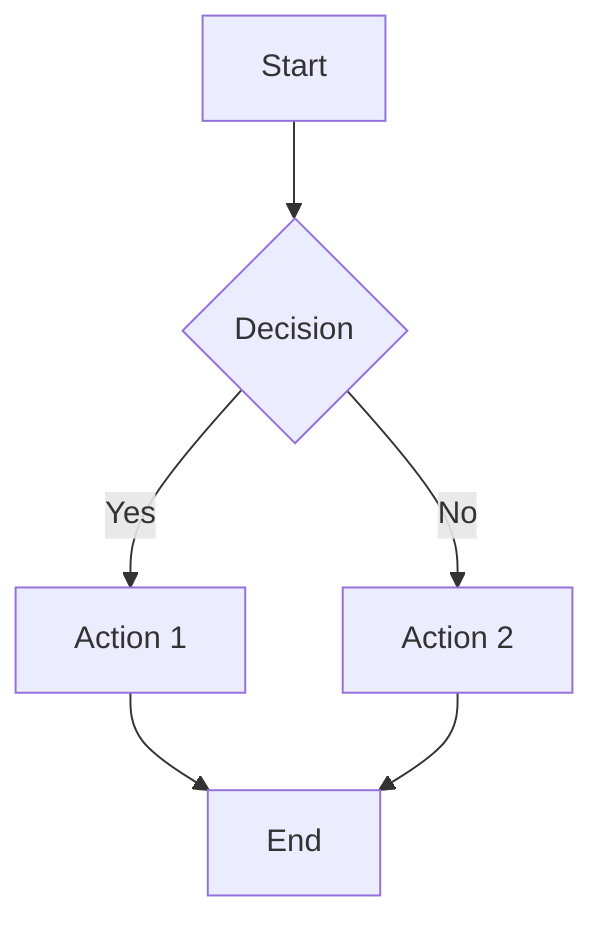
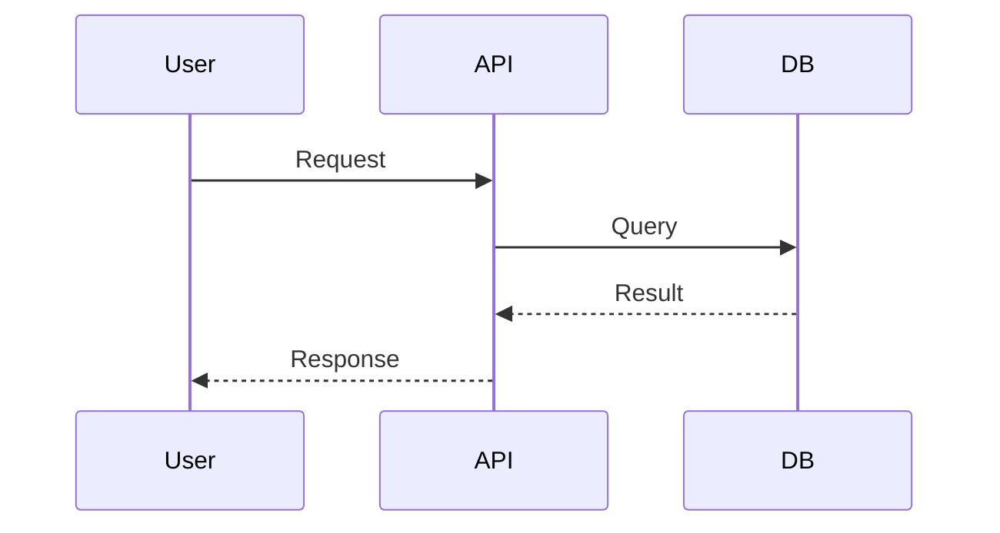
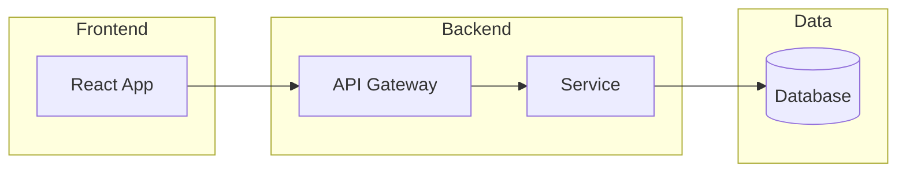

# Documentation Standards

## Core Principles

1. **Audience-First**: Write for your reader, not yourself
2. **Keep Current**: Outdated docs are worse than no docs
3. **Show, Don't Just Tell**: Use examples and diagrams
4. **Consistent Format**: Follow established patterns

## README Structure

```markdown
# Project Name

Brief description of what this project does.

## Features

- Feature 1
- Feature 2

## Installation

```bash
npm install my-project
```

## Quick Start

```javascript
import { thing } from 'my-project';
thing.doSomething();
```

## Documentation

Link to full docs.

## Contributing

Link to CONTRIBUTING.md.

## License

MIT - See LICENSE.

```

## Markdown Best Practices

### Headers
- Use `#` hierarchy (don't skip levels)
- Keep headers concise
- Use sentence case

### Code Blocks
````markdown
```python
def hello():
    print("Hello, World!")
```

````

### Lists
```markdown
- Unordered item
- Another item
  - Nested item

1. Ordered item
2. Another item
```

### Links and References
```markdown
[Link text](https://acme.com)
[Reference link][1]

[1]: https://acme.com
```

### Tables
```markdown
| Header 1 | Header 2 |
|----------|----------|
| Cell 1   | Cell 2   |
```

## Mermaid Diagrams

### Flowchart


### Sequence Diagram


### Architecture Diagram


## Technical Writing Tips

1. **Use active voice**: "The function returns a value" not "A value is returned"
2. **Be concise**: Remove unnecessary words
3. **Define acronyms**: Spell out on first use
4. **Use present tense**: "The function adds" not "The function will add"
5. **Include examples**: Show, don't just tell

## Detailed References

- **Markdown & Mermaid**: See [references/markdown-mermaid.md](references/markdown-mermaid.md)
- **Technical Writing**: See [references/technical-writing.md](references/technical-writing.md)
- **Open Source**: See [references/open-source.md](references/open-source.md)
