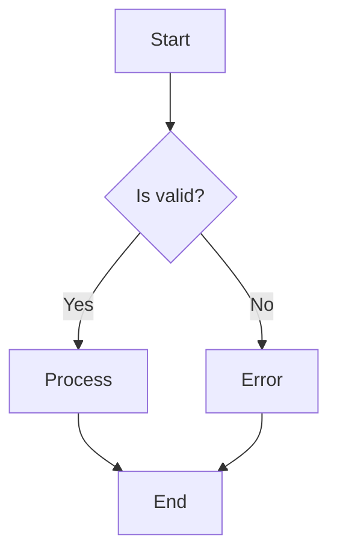
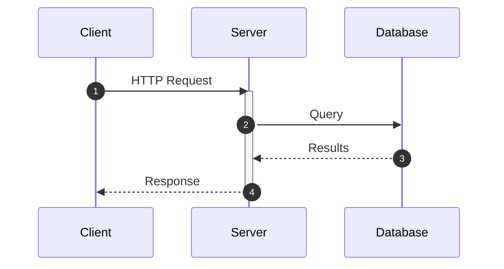
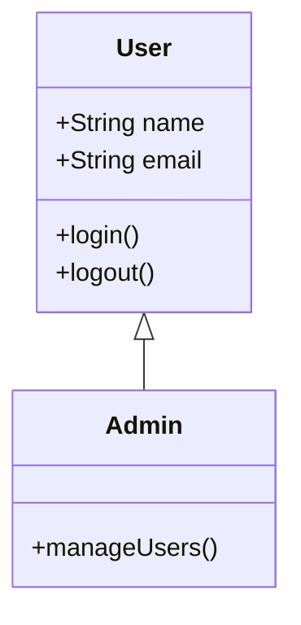
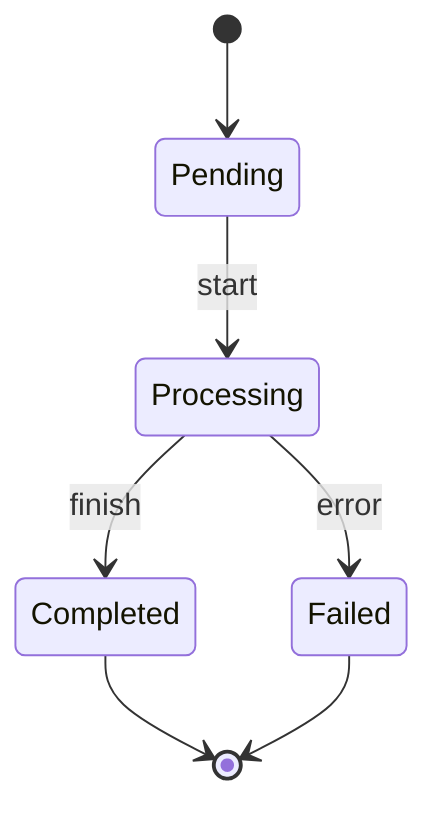
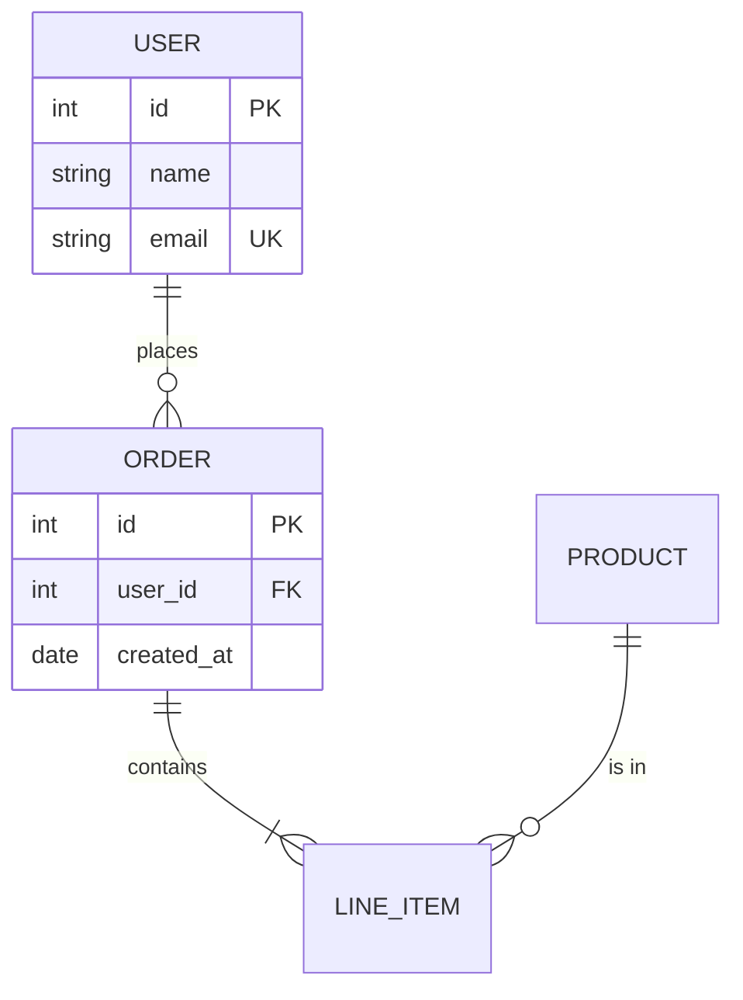
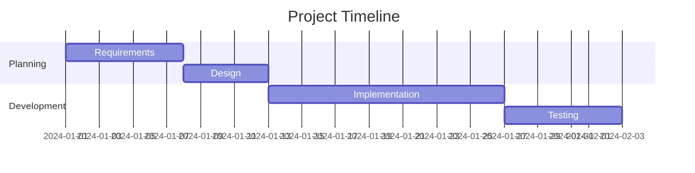
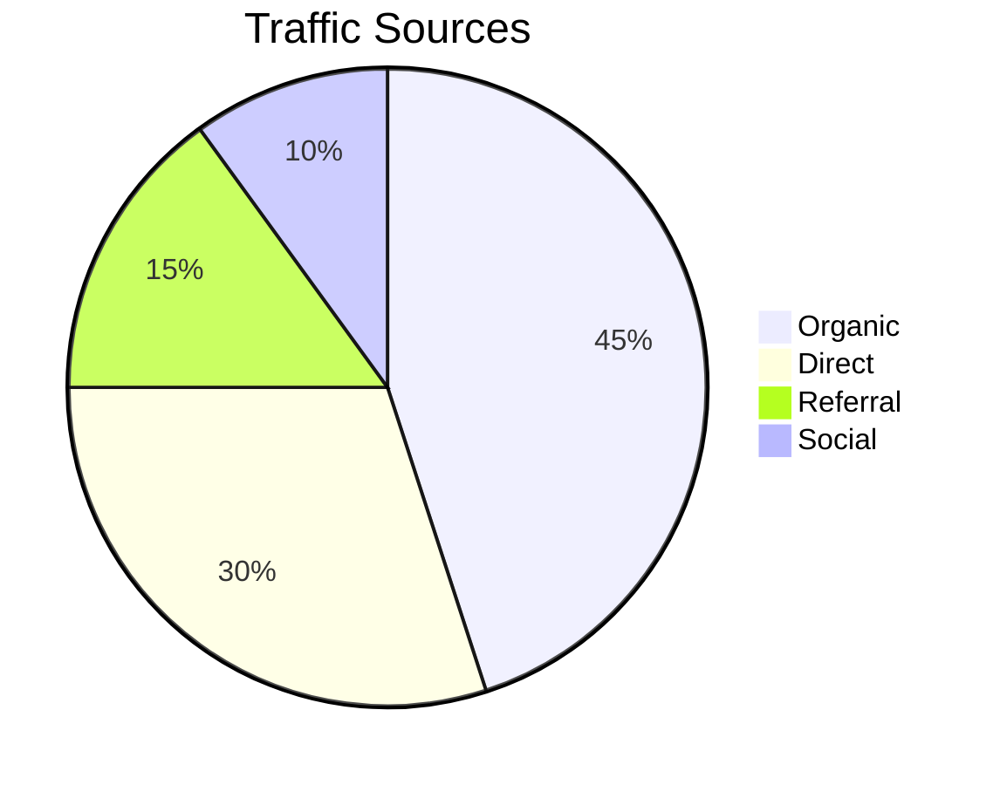

# Markdown & Mermaid

## Markdown Essentials

### Text Formatting

```markdown
**bold** or __bold__
*italic* or _italic_
~~strikethrough~~
`inline code`
```

### Block Quotes

```markdown
> This is a quote
> 
> — Author
```

### Task Lists

```markdown
- [x] Completed task
- [ ] Incomplete task
- [ ] Another task
```

### Collapsible Sections

```markdown
<details>
<summary>Click to expand</summary>

Hidden content here.

</details>
```

### Admonitions (GitHub)

```markdown
> [!NOTE]
> Information note

> [!TIP]
> Helpful tip

> [!WARNING]
> Warning message

> [!CAUTION]
> Critical warning
```

## Mermaid Diagrams

### Flowchart



### Sequence Diagram



### Class Diagram



### State Diagram



### Entity Relationship Diagram



### Gantt Chart



### Pie Chart



## Diagram Best Practices

1. **Keep it simple**: Don't overcrowd
2. **Use consistent styling**: Same colors, shapes
3. **Add labels**: Make relationships clear
4. **Limit scope**: One diagram per concept
5. **Include in docs**: Diagrams should live near related text
